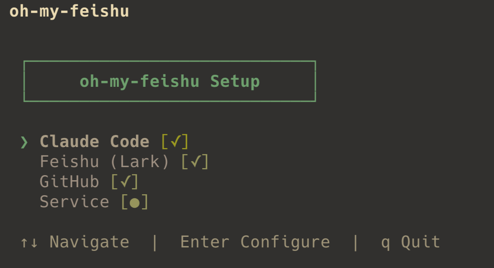
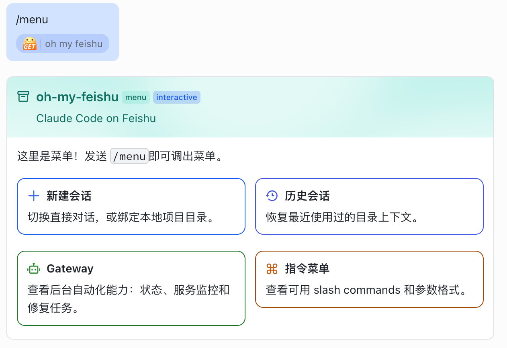

<h1 align="center">oh-my-feishu</h1>

  <strong>The best way to use Claude Code on Feishu.</strong>

  在飞书里直接使用 Claude Code：扫码配置、发送消息、打开菜单、绑定项目、触发后台自动化。

  
  
  
  

  <a href="#效果">效果</a> ·
  <a href="#开始使用">开始使用</a> ·
  <a href="#你可以做什么">你可以做什么</a> ·
  <a href="#roadmap">Roadmap</a>

## 效果

  

  <em>在飞书里提问，Claude Code 以流式卡片完整回复。</em>

  

  <em>第一次启动时，CLI 会引导配置并直接展示 QR 码扫码。</em>

  

  <em>发送 <code>/menu</code> 打开飞书交互菜单，开始使用会话和 Gateway 功能。</em>

## 开始使用

第一次打开 `oh-my-feishu`，CLI 会带你完成配置。你不需要记住复杂步骤，只需要跟随界面完成检查、扫码和启动。

完成后，在飞书里发送 `/menu`，就可以从菜单开始使用。

## 你可以做什么

### 在飞书里和 Claude Code 对话

不用切回终端，直接在飞书里问问题、讨论代码、查看 Claude Code 的完整回复。

### 用菜单管理工作上下文

通过 `/menu` 切换直接对话、目录会话和历史会话。普通问答可以直接聊；需要处理某个项目时，绑定到对应本地目录。

### 让飞书成为团队入口

团队成员可以在熟悉的飞书会话里触发 Claude Code，而不是每个人都重新理解本地命令和项目上下文。

### 使用 Gateway 后台自动化

Gateway 是后台能力入口。当前已经支持 Web 服务监控：注册 traceback 地址后，内容变化会触发 Claude Code 后台处理，并把最终结果发回飞书。

### 让 Claude Code 按需使用飞书能力

Claude Code 知道自己正在通过飞书与用户对话。普通问答直接回答；如果用户请求飞书操作，它会按需读取飞书技能。

## 菜单入口

- `新建会话`：开始直接对话或目录会话
- `历史会话`：恢复最近使用过的项目上下文
- `Gateway`：进入后台自动化服务
- `指令菜单`：查看可用指令

Web 服务监控入口：`/menu` -> `Gateway` -> `Web 服务监控` -> `新建监控`

填写服务名称、GitHub 仓库和 Traceback URL 后即可创建监控。

## Roadmap

- 支持包管理器一键安装
- 增加 README 头图和更多演示素材
- 增加更多 Gateway 服务
- 完善 Web 服务监控的列表、编辑、删除体验
- 让飞书能力在 Claude Code 中更自然地按需发现

## License

MIT
